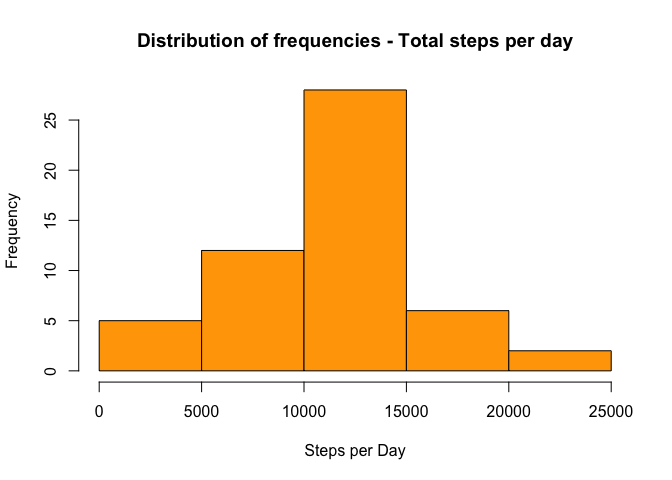
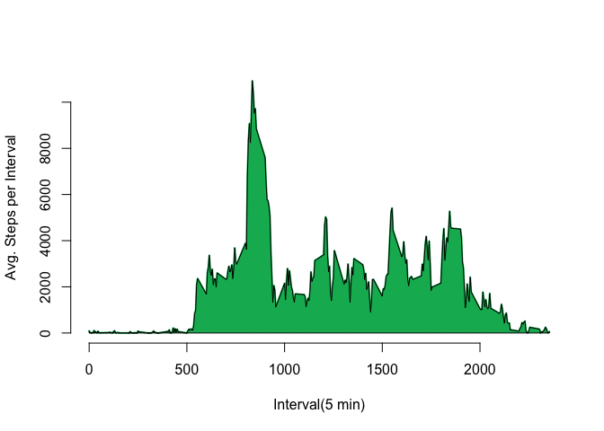
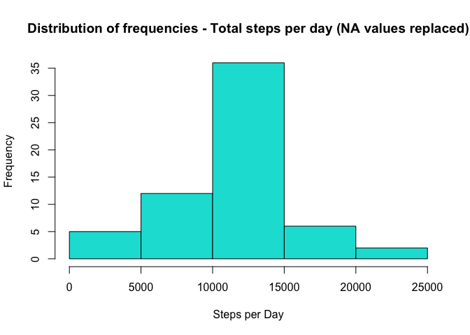
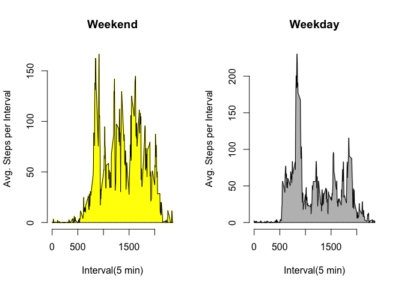

# Reproducible Research: Peer Assessment 1


## Loading and preprocessing the data


```r
echo=TRUE
library(plyr)
unzip("activity.zip")
activity=read.csv('activity.csv')
activity$date=as.Date(activity$date)
activ2=subset(activity,!is.na(activity$steps))
act2=ddply(activ2, .(date),summarize, steps.per.day=sum(steps))
```

## What is mean total number of steps taken per day?


```r
echo=TRUE
act2=ddply(activ2, .(date),summarize, steps.per.day=sum(steps))
```

# What is mean total number of steps taken per day?

For this part of the assignment, you can ignore the missing values in the dataset.

1. Calculate the total number of steps taken per day


```r
echo=TRUE
act2=ddply(activ2, .(date),summarize, steps.per.day=sum(steps))
act2
```

```
##          date steps.per.day
## 1  2012-10-02           126
## 2  2012-10-03         11352
## 3  2012-10-04         12116
## 4  2012-10-05         13294
## 5  2012-10-06         15420
## 6  2012-10-07         11015
## 7  2012-10-09         12811
## 8  2012-10-10          9900
## 9  2012-10-11         10304
## 10 2012-10-12         17382
## 11 2012-10-13         12426
## 12 2012-10-14         15098
## 13 2012-10-15         10139
## 14 2012-10-16         15084
## 15 2012-10-17         13452
## 16 2012-10-18         10056
## 17 2012-10-19         11829
## 18 2012-10-20         10395
## 19 2012-10-21          8821
## 20 2012-10-22         13460
## 21 2012-10-23          8918
## 22 2012-10-24          8355
## 23 2012-10-25          2492
## 24 2012-10-26          6778
## 25 2012-10-27         10119
## 26 2012-10-28         11458
## 27 2012-10-29          5018
## 28 2012-10-30          9819
## 29 2012-10-31         15414
## 30 2012-11-02         10600
## 31 2012-11-03         10571
## 32 2012-11-05         10439
## 33 2012-11-06          8334
## 34 2012-11-07         12883
## 35 2012-11-08          3219
## 36 2012-11-11         12608
## 37 2012-11-12         10765
## 38 2012-11-13          7336
## 39 2012-11-15            41
## 40 2012-11-16          5441
## 41 2012-11-17         14339
## 42 2012-11-18         15110
## 43 2012-11-19          8841
## 44 2012-11-20          4472
## 45 2012-11-21         12787
## 46 2012-11-22         20427
## 47 2012-11-23         21194
## 48 2012-11-24         14478
## 49 2012-11-25         11834
## 50 2012-11-26         11162
## 51 2012-11-27         13646
## 52 2012-11-28         10183
## 53 2012-11-29          7047
```

```r
sum(act2$steps.per.day)
```

```
## [1] 570608
```


2. If you do not understand the difference between a histogram and a barplot, research the difference between them. Make a histogram of the total number of steps taken each day


```r
echo=TRUE
hist(act2$steps.per.day, col = 'orange',xlab='Steps per Day', main='Distribution of frequencies - Total steps per day')
```

 

3. Calculate and report the mean and median of the total number of steps taken per day


```r
echo=TRUE
mean(act2$steps.per.day)
```

```
## [1] 10766.19
```

```r
median(act2$steps.per.day)
```

```
## [1] 10765
```

## What is the average daily activity pattern?

1. Make a time series plot (i.e. type="l") of the 5-minute interval (x-axis) and the average number of steps taken, averaged across all days (y-axis)


```r
echo=TRUE
act3=ddply(activ2, .(interval),summarize, avg.steps.interval=sum(steps))
plot(act3$avg.steps.interval~act3$interval, type='l', xlab='Interval(5 min)',ylab='Avg. Steps per Interval', col = '#04B45F', lwd=2, bty="n")
xx <- c(act3$interval, rev(act3$interval))
yy <- c(rep(0, nrow(act3)), rev(act3$avg.steps.interval))
polygon(xx, yy, col='#04B45F')
```

 

2. Which 5-minute interval ,on average across all the days in the dataset, contains the maximum number of steps?


```r
echo=TRUE
act3$interval[which.max(act3$avg.steps.interval)]
```

```
## [1] 835
```

## Imputing missing values

Note that there are a number of days/intervals where there are missing values (coded as NA). The presence of missing days may introduce bias into some calculations or summaries of the data.

Calculate and report the total number of missing values in the dataset (i.e. the total number of rows with NAs)


```r
echo=TRUE
actNA=ddply(activity, .(date),summarize, NA.steps=sum(is.na(steps)))
actNA=subset(actNA,NA.steps !=0)
sum(actNA$NA.steps)
```

```
## [1] 2304
```

Devise a strategy for filling in all of the missing values in the dataset. The strategy does not need to be sophisticated. For example, you could use the mean/median for that day, or the mean for that 5-minute interval, etc.

Create a new dataset that is equal to the original dataset but with the missing data filled in.


```r
echo=TRUE
# New dataset with NA data to be replaced with means for given intervals:
activity2=activity

for(i in 1:17568){
  interv=activity2[i,3]
  # If steps value in activity2 is NA...
  if(is.na(activity2[i,1])){
    # Replace NA Value for the mean of the interval
    activity2[i,1]=mean(activity2[activity2$interval==interv,]$steps,na.rm = TRUE)
  }
}
```

Make a histogram of the total number of steps taken each day...


```r
echo=TRUE
act2NAf=ddply(activity2, .(date),summarize, steps.per.day=sum(steps))
hist(act2NAf$steps, col = '#01DFD7',xlab='Steps per Day', main='Distribution of frequencies - Total steps per day (NA values replaced)')
```

 

We can see that the overall frequencies increased in this new histogram, but the distribution of frequencies keeps almost the same shape, resembling the normal distribution. 

...and Calculate and report the mean and median total number of steps taken per day. Do these values differ from the estimates from the first part of the assignment? What is the impact of imputing missing data on the estimates of the total daily number of steps?


```r
echo=TRUE
mean(act2$steps.per.day)
```

```
## [1] 10766.19
```

```r
median(act2$steps.per.day)
```

```
## [1] 10765
```

In this dataset with replaced NA values, mean and median are the same as the dataset with NA values untouched.

## Are there differences in activity patterns between weekdays and weekends?


```r
echo=TRUE
activity2$weekdays=weekdays(activity2$date)
activ2sem=subset(activity2, activity2$weekdays=="Segunda Feira" | activity2$weekdays=="Terça Feira" | activity2$weekdays=="Quarta Feira" | activity2$weekdays=="Quinta Feira" | activity2$weekdays=="Sexta Feira")
act2ds=ddply(activ2sem, .(interval),summarize, avg.steps.day=mean(steps))
activ2fds=subset(activity2, activity2$weekdays=="Sábado" | activity2$weekdays=="Domingo" )
```

```r
echo=TRUE
act2fds=ddply(activ2fds, .(interval),summarize, avg.steps.day=mean(steps))
#panelplot:
par(mfrow=c(1,2))
#plot 1 - fds
plot(act2fds$avg.steps.day~act2fds$interval, type='l', xlab='Interval(5 min)',ylab='Avg. Steps per Interval', col = 'yellow', lwd=2, bty="n", main='Weekend')
xx2 <- c(act2fds$interval, rev(act2fds$interval))
yy2 <- c(rep(0, nrow(act2fds)), rev(act2fds$avg.steps.day))
polygon(xx2, yy2, col='yellow')
# plot2
plot(act2ds$avg.steps.day~act2ds$interval, type='l', xlab='Interval(5 min)',ylab='Avg. Steps per Interval', col = 'grey', lwd=2, bty="n", main='Weekday')
xx3 <- c(act2fds$interval, rev(act2fds$interval))
yy3 <- c(rep(0, nrow(act2ds)), rev(act2ds$avg.steps.day))
polygon(xx3, yy3, col='grey')
```

 
